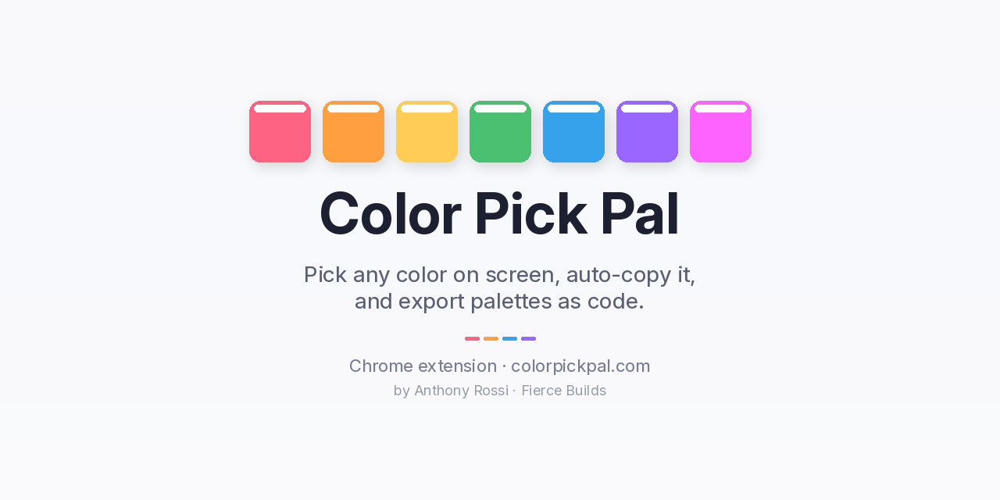

# Color Pick Pal

Pick any color on screen with the native EyeDropper. It auto-copies the color, and Pro adds palettes, more formats, and code export.

**[Install from the Chrome Web Store](https://chromewebstore.google.com/detail/kmhflabmkfmnmgkbockcmaebpmlnnimf)** · **Website:** [colorpickpal.com](https://colorpickpal.com)

## Features
- Pick any color on screen using the browser's native EyeDropper
- Picked colors are copied to your clipboard automatically
- **Pro:** save palettes, switch color formats, and export palettes as code

## Tech
Chrome extension (Manifest V3) · JavaScript/TypeScript · EyeDropper API

## How I built it
I designed and built Color Pick Pal myself using AI-assisted development (Lovable/Dyad/Cursor), then tested, refined, and published it to the Chrome Web Store, including the Pro tier. I own the full lifecycle, from design to release.

---
Built by [Anthony Rossi](https://www.linkedin.com/in/anthonyrossi01) · [Fierce Builds](https://www.fiercebuilds.com/portfolio)
